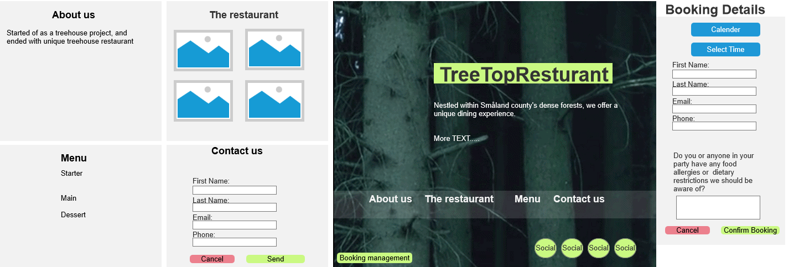

# Woodhouse Treetop 
A high-end dining experience in the treetop canopy.

***👉  [Link to Live project](https://woodhouse-a901e0e256cb.herokuapp.com)***

---
***Link to the initial project (Abandoned due to numerous initial mistakes)***
- [Initial Project](https://github.com/Moonchichiii/woodhouse_p4)

---
## Table of Contents
 
 1. [Site Owner Goals](#site-owner-goals)
 2. [User Stories](#user-stories)
 3. [Project Goals](#project-goals)
 4. [Main Page Content](#main-page-content)
 5. [Wireframes](#wireframes)
 6. [Features](#features)
 7. [Testing](#testing)
 8. [Technologies Used](#technologies-used)
 9. [Dependencies](#dependencies)
10. [Deployment](#deployment)
11. [Credits & Tutorials](#credits)

## Site Owner Goals
- The site owner desires online booking capabilities for the restaurant.

**External User’s Goal:**
- Users should be able to easily book for one or more guests at a specified time and date.

## Project Goals
- **Online Bookings:** Provide a basic online booking feature, considering constraints like avoiding double bookings and managing the number of guests to prevent overbooking.
- **Display of Information:** Showcase essential information like menus and location, while balancing simplicity and design for large video content.
- **User Experience:** Ensure a user-friendly and minimalist website.
- **Responsiveness:** Develop a responsive design, prioritizing accessibility across various devices.
- **Management Accessibility:** Incorporate management login functionality for administrative tasks.

## Main Page Content:
- Navigation Menu (Navbar)
- Book a Table (Opens a Booking Modal)
- Cancel a Booking (Opens a Cancel Modal)
- Map Display
- Management login
- Social Media Icons

## Wireframes

Design and Planning Stages

- **Wireframe:** Created using Axure RP10 to visualize the structure, layout, and user flow.

## User Stories
- **First-time Visitor:** Discover what the restaurant offers and quickly grasp the site's purpose.
- **Potential Visitor:** Easily navigate, find the menu, and book a table.
- **Returning Visitor:** Make adjustments to bookings directly on the site.
- **Administration:** Manage bookings and update menu content efficiently.

## Features
- **Date/Time-based bookings**
- **Avoid double bookings**
- **Cancellations**
- **Menu-display**

### Features to be added later:
- **Multiple table occupancies**

# Technologies Used
- **HTML**
- **CSS**
- **JavaScript**
- **Python+Django**

# Dependencies

- Django==4.1
Django 4.1, released on August 3, 2022, brought a plethora of new features, including an async interface to the ORM, the ability to define async handlers on class-based views, the use of ORM-defined database constraints in model validation, and improvements in form rendering accessibility and output style customization.

- gunicorn==21.2.0
Gunicorn, a pre-fork worker model ported from Ruby's Unicorn project, is broadly compatible with various web frameworks, simple to implement, light on server resource usage, and fairly speedy.

- django-anymail==10.1
[django-anymail](https://github.com/anymail/django-anymail) allows you to send and receive email in Django using your choice of transactional email service providers (ESPs). It extends the standard `django.core.mail` with many common ESP-added features, providing a consistent API that avoids locking your code to one specific ESP.

- django-crispy-forms==2.0
Django-crispy-forms helps in creating beautiful forms in Django in a very elegant and DRY way. It allows you to control the rendering behavior of Django forms.

- django-environ==0.11.2
Django-environ allows you to utilize 12factor inspired environment variables to configure your Django application.

- dj-database-url==2.1.0
This utility lets you configure your Django application's database connection using environment variables.

- django-widget-tweaks==1.5.0
Django Widget Tweaks is for making Django form widgets more customizable and CSS-friendly.

- dj3-cloudinary-storage==0.0.6
This package provides backends for Django's file storage API, allowing you to use Cloudinary for media uploads in your application.

- psycopg2==2.9.8
Psycopg2 is a PostgreSQL adapter for Python, used in Django to connect to PostgreSQL databases.

- python-decouple==3.8
A Python library for separating configuration parameters from code, allowing parameters to be set via environment variables or INI files.

- sqlparse==0.4.4
A non-validating SQL parser module for Python, it's used to split the input SQL strings into a list of statements and perform other minor transformations on the input.

-  cloudinary==1.35.0
Cloudinary is a cloud service that offers a solution to a web application's entire image and video management pipeline.

- urllib3==1.26.16
A powerful, user-friendly HTTP client for Python, used by the most popular Python HTTP library, `requests`.

- whitenoise==5.3.0
WhiteNoise allows your web app to serve its own static files, making it a self-contained unit that can be deployed anywhere.

- coverage==7.3.1

[Coverage.py](https://coverage.readthedocs.io/en/coverage-5.5/) 

- It monitors which parts of your code have been executed during the testing process, 
helping developers identify areas of the codebase that haven’t been tested. This is crucial for understanding.

# Deployment

#### Development Environment: Gitpod
- Gitpod, an online IDE, streamlined the coding experience, removing the need for local setup and promoting efficient development.

#### Hosting Static Assets: Cloudinary
- Static assets such as stylesheets, JavaScript files, images, and videos are hosted on Cloudinary.
- Cloudinary is a cloud-based service that efficiently manages and optimizes media files for improved performance.

#### Deploying on Heroku
- For smooth deployment on Heroku, it is essential to manage static files effectively.
- It is recommended to set `DISABLE_COLLECTSTATIC=1` during deployment to avoid issues with static files collection.

#### Database Management: ElephantSQL PostgreSQL
- The project uses ElephantSQL PostgreSQL for secure and efficient database management.
- Ensuring a seamless operation of the database.

#### Balancing Functionality and Usability
- Attention to these details aids in maintaining a balance between functionality and usability.
- The aim is to ensure a reliable and user-friendly application from development to deployment.

# Credits & Tutorials

Good documentation and tutorials

- https://github.com/anymail/django-anymail

- https://stackoverflow.com/questions/7304248/how-should-i-write-tests-for-forms-in-django

- https://stackoverflow.com/questions/68762265/django-aggregate-sum-for-each-user

- https://simpleisbetterthancomplex.com/article/2017/08/19/how-to-render-django-form-manually.html

- https://overiq.com/django-1-10/django-form-basics/ 

- https://www.youtube.com/watch?v=ynToND_xOAM **How to style the form with bootstrap in django.**

- https://stackoverflow.com/questions/19123715/django-for-loop-to-iterate-form-fields

- https://docs.djangoproject.com/en/4.2/topics/forms/

- https://stackoverflow.com/questions/29716023/add-class-to-form-field-django-modelform

- https://stackoverflow.com/questions/51202769/submit-form-with-event-listener

- https://cbi-analytics.nl/django-google-maps-tutorial-4-creating-a-google-map-maps-javascript-api/

- https://stackoverflow.com/questions/76762773/ date-and-number-of-guests-validation-in-booking-application-with-django

